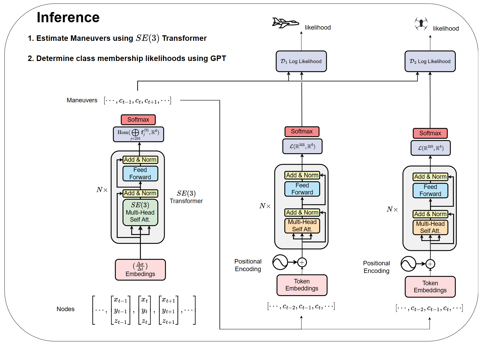

<div align="center">

<h1>Steerable Inductive Biases for Flight Maneuver Reconstruction</h1>

<h4><b>Clayton Curry</b></h4>
<br>

[](https://claycurry.com/blog/maneuver)
[](https://claycurry.com/Curry%20-%20Flight%20Maneuvers%20%28draft%20report%29.pdf)
[](https://colab.research.google.com/drive/13U6SEHBlYxXKCvmLBXeERzIb5dt2lEfA?usp=sharing)
[](https://github.com/clay-curry/Flight-Maneuvers) 

</div> 

**note:**

* this project is ongoing and remains under active development (see [draft report here](https://claycurry.com/Curry%20-%20Flight%20Maneuvers%20%28draft%20report%29.pdf)),
* contributions and / or improvements are welcome (make a pull request),
* remaining tasks are documented under the [Steerable Flight Maneuvers](https://github.com/users/clay-curry/projects/1)

## Description
Rapid innovation in both commercial and consumer-orientied drone-based technology have intensified the demand for intelligent airspace monitoring systems capable of transponder-free [automatic target recognition](https://en.wikipedia.org/wiki/Automatic_target_recognition) (ATR) with post-hoc interpretability. Adajectly, learning algorithms have seen monumental gains in sequence modeling capabilities through large language models and advances in the mathematical foundations of deep learning.

In this project, a proof-of-concept system is developed to showcase the extent that such methods can be used for ATR, conditioned on having access to the physical trajectory of an aerial target. Of relevance is the question of what learning gains and generalization properties are afforded by imposing certain inductive biases to control the complexity of the model and restrict hypotheses to be consistent with the physical symmetries of the task.

For ease of reproducibility, this project is supported on the Python Package Index with relevant data hosted on Kaggle.

### Related Projects

* [Escnn (QUVA-Lab)](https://github.com/QUVA-Lab/escnn)
* [e3nn (Lawrence Berkeley National Laboratory)](https://github.com/e3nn/e3nn/)
* [Megatron-LM (NVIDIA)](https://github.com/NVIDIA/Megatron-LM)
* [Modulus (NVIDIA)](https://github.com/NVIDIA/modulus)

## Prerequsites

The following illustration depicts the proper setting in which our project is intended to function:


More information (exceeding the scope of this project) regarding the structure of airspace monitoring systems can be found in the following references:
* [How Radars Work (MATLAB)](https://www.mathworks.com/discovery/how-do-radars-work.html)
* [Track multiple objects in autonomous and surveillance applications](https://www.mathworks.com/discovery/multi-object-tracking.html)
* [Fundamentals of Object Tracking](https://www.cambridge.org/core/books/fundamentals-of-object-tracking/A543B0EA12957B353BE4B5D0602EE945)
* [Advances in Statistical Multisource-Multitarget Information Fusion](https://www.vitalsource.com/products/advances-in-statistical-multisource-multitarget-ronald-p-s-mahler-v9781608077991?duration=perpetual&utm_source=bing&utm_medium=cpc&utm_campaign=Catch%20AllGoogle-US&msclkid=bf38ee6c5721119d10418aefb5cc39e0)

## Assumptions

### ATR
`TODO`

### Observed and Latent Variables
In our work, we use 'trajectory' to mean an abstract, time-evolving, kinematic state (velocity and position) characterizing the motion of precisely one target moving through a field-of-view. 
Consistent with real-world systems, this state is observed with fixed, sampling with an underlying assumption that each state coincides with a non-observable 'maneuver' describing the action taken by the agent to influence control over the state of the aircraft at each timestep.
The following figure illustrates a top-down view of a particular episode of this process,


where color-coded rectangles correspond to instantanously observed maneuvers and color-coded arrows encode the instantanous velocity portion of the states.
The set of all actions that could be taken is assumed to be finite, and the agent's choices are assumed to be Markovian.

The trustworthiness of any ATR system depends on its ability to identify and logically reason with the fundamental uncertainty involved in recognizing targets.
Crucially, we assume (reasonably) that each trajectory is a stochastic processes with probability density uniquely corresponding to the identity of the aircraft that produced the trajectory.
Provided knowledge of this distribution for any particular target, the ATR system can then return a likelihood.

### Problem Statement

Having defined all the terms, we can adequately account for the are ready to state the problem  

A set trajectories  are obtained by independently drawing examples from a 


Using labeled examples we can train one transformer to estimate latent maneuvers, conditioned on the given states





## Directory Structure and Usage

```
.
├── README.md
├── app.py                              # opens web app on localhost created using Dash and Flask 
├── main.py                             # runs experiments on local hardware after parsing CLI arguments
│
├── examples
│   ├── introduction.ipynb              # A gentle introduction to background and methodology used in project
│   └── TODO                            # TODO
│
│
└── src
    ├── model
    │   ├── resnet_1D.py                # ordinary residual blocks and network operating on a sampled timeseries
    │   ├── se2_resnet_1D.py            # TODO
    │   └── se3_resnet_1D.py            # TODO
    │
    ├── data_module.py                  # defines classes extending pytorch data utilities 
    ├── neural_search.py                # TODO
    └── utils.py                        # standard utilities for plotting results, obtaining statistics, and pre-/postprocessing data
```


## How to run

First, create a new conda environment *using Python 3.7* and activate it as follows

```bash
# create env
conda create -n flight-maneuvers python=3.7
# activate it
conda activate flight-maneuvers
 ```   

Next, clone the repo, navigate to the project base, and install requirements,
 ```bash
# clone project   
git clone https://github.com/clay-curry/Flight-Maneuvers
# enter project
cd Flight-Maneuvers
# install dependencies
pip install -r requirements.txt
```

Finally, pass a supporting argument to the main module as follows
```
# run module (example: mnist as your main contribution)   
python main.py  COMMAND
```

where `COMMAND` is chosen from the following table:

| COMMAND  | Description |
| -------- | ----------- |
| fetch    | invokes 'curl' to download 1000 pre-simulated training examples |
| train    | instantiates a model and invokes routines for training |
| evaluate | assesses model performance using a randomized ANOVA procedure |
| app      | starts a web server on localhost and serves models using Flask |


## Acknowledgements

This work was only possible thanks to grant `TODO` and a close partnership between my school and domain experts at Oklahoma City Air Logistics Complex and the [Oklahoma Aerospace and Defense Innovation Institute](https://www.ou.edu/oadii). Such partnerships allow for the symbiotic exchange of ideas required from innovation and modernization, and are likely to facilitate similar works provided continued support.